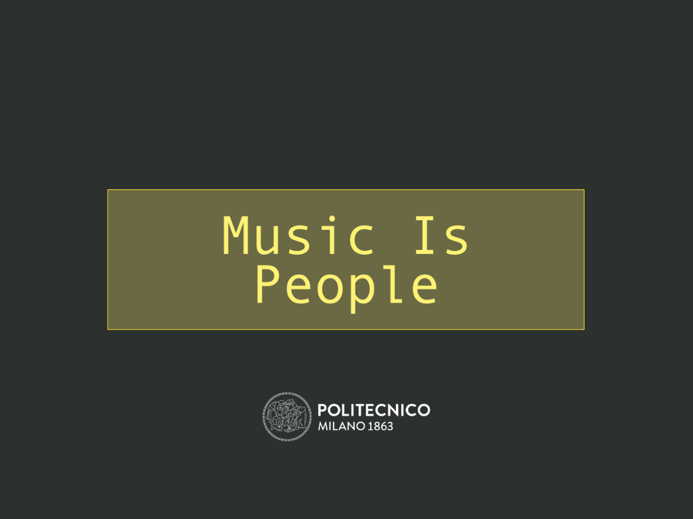

# Music Is People

Music Is People is a creative application that harnesses the power of collective creativity to compose unique musical pieces. The project revolves around a neural network architecture that generates music based on user feedback. By actively involving users in the composition process, Music Is People aims to emphasize the idea that small individual actions can collectively create something magnificent and inspiring.

Through an intuitive user interface, participants have the opportunity to listen to a previously generated song and provide feedback on their experience. This feedback is then fed back into the neural network, which analyzes and interprets the input to generate a new composition. The newly created song is played for the next user, creating an iterative and collaborative musical journey.

## Objectives
The primary objectives of Music Is People are:

-  Engaging users in an interactive music composition process.
-  Showcasing the creative potential of collective feedback and iterative generation.
-  Exploring the relationship between user feedback and the resulting musical compositions.
-  Fostering a sense of empowerment and artistic collaboration among participants.
-  Conveying the message that individual contributions, no matter how small, can lead to something remarkable and beautiful.

## Artistic Message
At the core of Music Is People lies an artistic message that seeks to evoke a realization among individuals that their seemingly insignificant actions can come together to create something greater than themselves. By involving users in the musical composition process, the project aims to highlight the profound impact that collective creativity can have on the creation of art. It encourages participants to appreciate the value of their contributions, fostering a sense of empowerment, and reinforcing the belief that collaboration and cooperation can lead to extraordinary outcomes.

## Background and Inspiration
Music Is People draws inspiration from the concept of crowdsourcing and collective intelligence. The project is motivated by the idea that diverse perspectives and individual input can contribute to the creation of exceptional artistic expressions. The project team also acknowledges the transformative power of technology in enabling collaborative endeavors and aims to explore its application in the realm of music composition.

By building on the advancements in neural network architectures and interactive interfaces, Music Is People seeks to provide a platform for users to actively engage in the creative process and witness the tangible results of their input. The project aims to demonstrate that art can transcend boundaries, unite people, and create a profound emotional impact when rooted in collective action.

## How to use Music Is People
You can follow this tutorial to run the application on your own machine.

### Requirements
To run Music Is People in its entirety, you need three distinct softwares:

- [Python](https://www.python.org) (from version 3.9 or higher)
- [Processing](https://processing.org) (latest available version)
- [TouchOSC](https://hexler.net/touchosc) (version 2.0 from their website)

### Step 0 - Download the Repo
To run the various components of the application, you first need to download the github repo on your local machine. In order to do that, you can simply go on the main branch of the GitHub repo and press ´Code -> Download ZIP´. You then need to extract the zip file and put it somewhere inside your system.

### Step 1 - Python Script
We will assume that you extracted the zip file containing the repo to the following path:

´´´
/Users/Pippo/Documents/CPAC_MusicIsPeople
´´´

To run the python script, open your terminal and run the following commands, one by one:

´´´
cd /Users/Pippo/Documents/CPAC_MusicIsPeople/python   [1]
python3 -m venv venv                                  [2]
source ./venv/bin/activate                            [3]
python3 -m pip install -r ./requirements.txt          [4]
python3 ./src/main.py                                 [5]
´´´

These will, in order:

1. Navigate to the project's folder.
2. Create a virtual environment to run the script.
3. Activate the virtual environment.
4. Install all module requirements inside your freshly activated virtual environment.
5. Run the python script.

If everythin works correctly, the program should run and then wait for the visualizer to connect (you should see a text saying ´Connecting to visualizer...´.

### Step 2 - Processing Script
To run the Processing script, simply open the processing application, select ´File->Open´ from the app's menu and open the file named ´MusicIsPeople_GUI.pde´ located in ´/MusicIsPeople_GUI´

### Step 3 - TouchOSC Script
To run the TouchOSC script, again simply run the application, select file ´MusicIsPeople.tosc´ and once open click on the grey button on the top right of your screen to run the script.

### Step 4 - Enjoy!
At this point you should be able to use the application however you like by interacting with the TouchOSC script. Enjoy! :) 

## Other Info
For more informations about the project's implementation or other doubts, please consult either the code documentation or the full pdf report of the project. You can find them both inside this repo, under ´Documentation´.

## The Team
Music Is People was made by students at Politecnico di Milano:
- Francesco Piferi (francesco.pifer@mail.polimi.it)
- Riccardo Rossi (riccardo18.rossi@mail.polimi.it)
- Ferdinando Terminiello (ferdinando.terminiello@mail.polimi.it)
